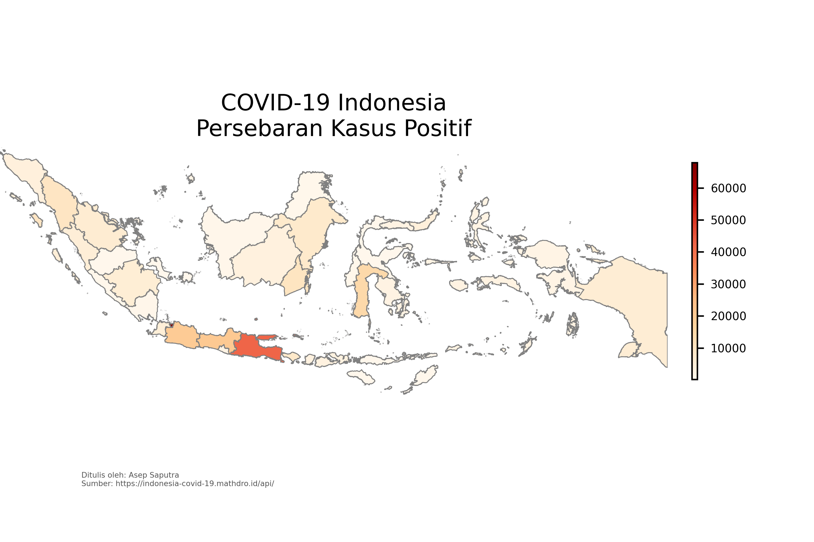
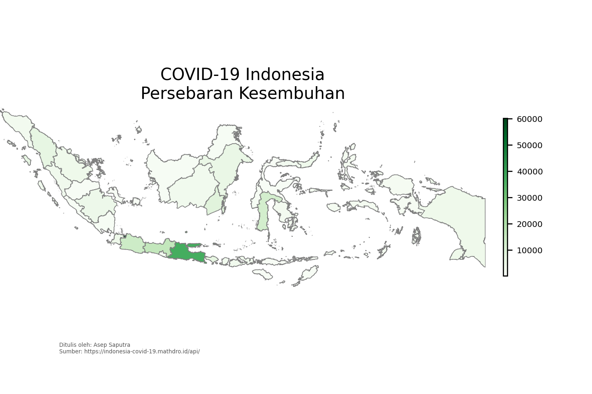
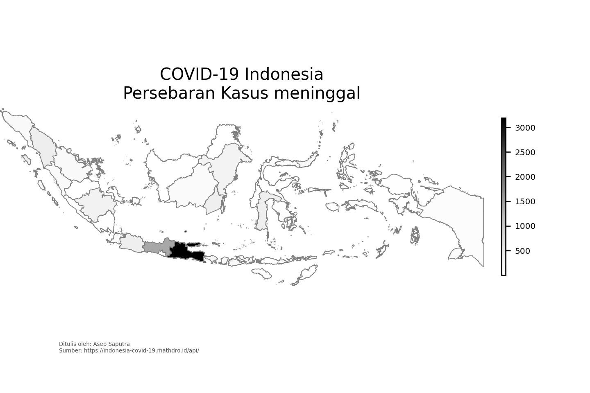

# COVID-19 di Indonesia  

----------------------------------------------------------------------------
## Positif
- Jumlah kasus positif di setiap provinsi yang ada di Indonesia  

    

  

- Peta sebaran  
  

## Sembuh
- Jumlah kasus kesembuhan di setiap provinsi yang ada di Indonesia  

    

  

- Peta sebaran
  

## Meninggal
- Jumlah kasus meninggal di setiap provinsi yang ada di Indonesia  

    

  

- Peta sebaran

----------------------------------------------------------------------------
## `Compare` total kasus  

    

  

# Geodata
----------------------------------------------------------------------------

Batas wilayah tiap provinsi di Indonesia administrative level 0–4 boundaries.

Sumber : https://data.humdata.org/dataset/indonesia-administrative-boundary-polygons-lines-and-places-levels-0-4b